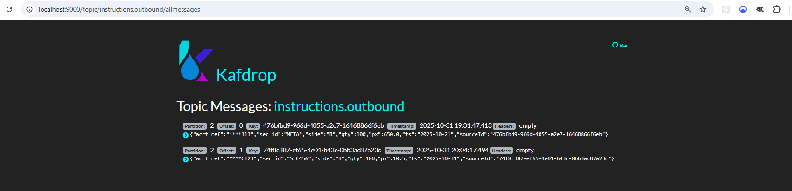

# Trades Capture Service

Implements the requirements: file/kafka input, canonical transform (mask account, uppercase security ID, normalize trade type), platform JSON, Kafka publish, in-memory store, security, performance considerations, tests, Swagger, Dockerfile.

## Run
```
mvn clean package
java -jar target/trades-capture-service-1.0.0.jar
```
Configure Kafka in `application.yml` (localhost:9092 by default).

## Endpoints
- `POST /api/v1/upload/file` (multipart) CSV/JSON
- `POST /api/v1/upload/json` (list of objects)

CSV headers:
```
account_number,security_id,trade_type,quantity,price,trade_date
```
Swagger UI: `/swagger-ui.html`


